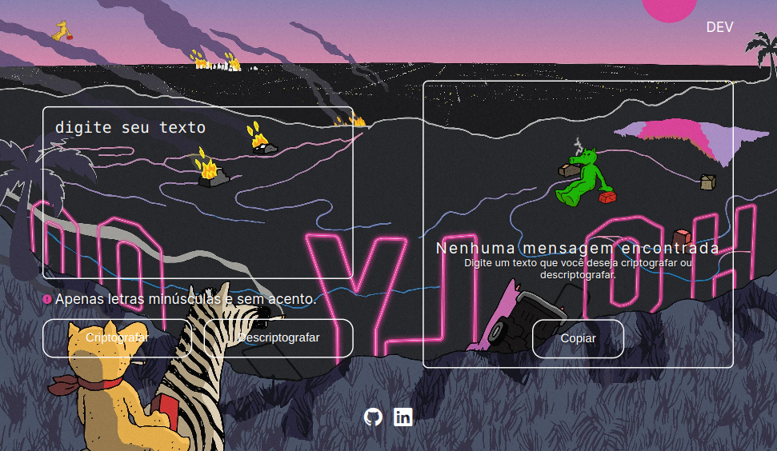

<h1>Decodificador - ONE Alura</h1>

Essa é uma aplicação que criptografa textos, desenvolvida com HTML, CSS e JavaScript.

As "chaves" de criptografia que utilizaremos são:
A letra "e" é convertida para "enter"
A letra "i" é convertida para "imes"
A letra "a" é convertida para "ai"
A letra "o" é convertida para "ober"
A letra "u" é convertida para "ufat"

Funcionamento:
<li>Funciona apenas com letras minúsculas</li>
<li>Não devem ser utilizados letras com acentos nem caracteres especiais</li>

 
Por exemplo:
"gato" => "gaitober"
gaitober" => "gato"

